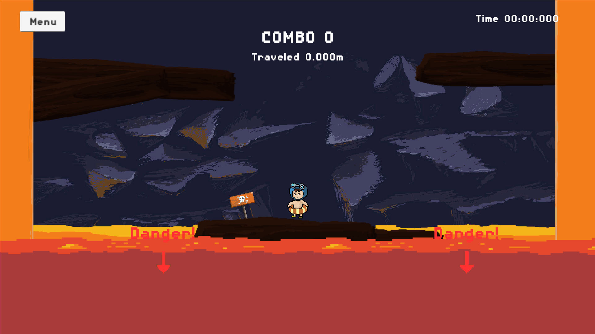

# Avoid Lava The Game
by Adrian Alonzo

The object is simple: Avoid the lava!

### Controls : Click on Character, Drag, Aim, and Let go!
Strategy: Use the obstacles in your favor, bounce off them and angle the mouse to bounce around objects. You can only jump once! Your jumps are replenished when you touch a ground platform. Touch the bottom Lava and its game over! Touching the side lava walls will temporairly disable your control until you touch another ground platform.

